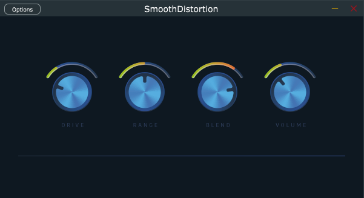

# Smooth Distortion

Guitar distortion audio plugin made in C++ with the Juce framework The DSP algorithm is based on a sigmoid function.


### Build
Since Visual Studio and CLion have built-in support for CMake, you can open the CMakeLists file with the IDE and it will automatically detect the project to configure your toolchain and build targets from there. (I prefer CLion).

Anyway, you can generate a build tree by using:
#### Windows
```
cmake -B build -G "Visual Studio 17 2022"
```

#### Mac
```
cmake -B build -G Xcode
```

Then open the solution with your IDE and build/run/debug the target you like.